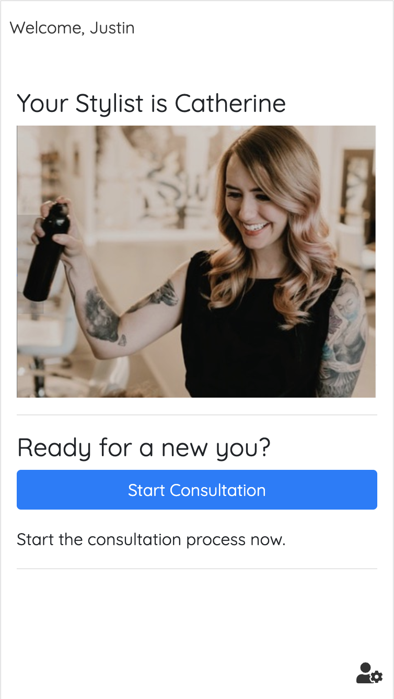
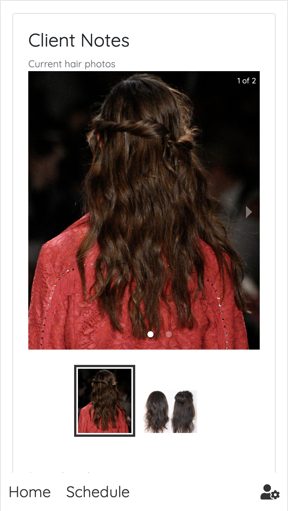
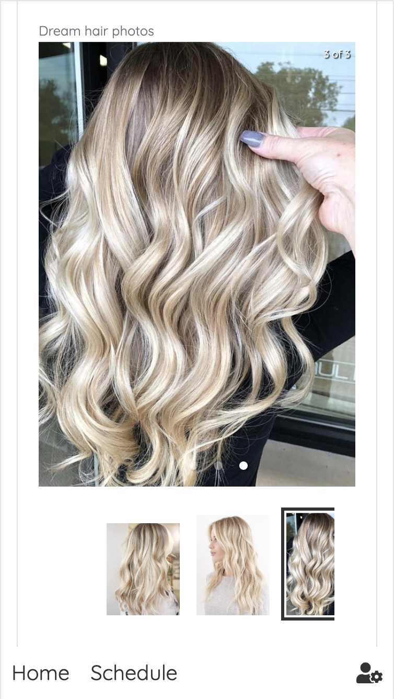
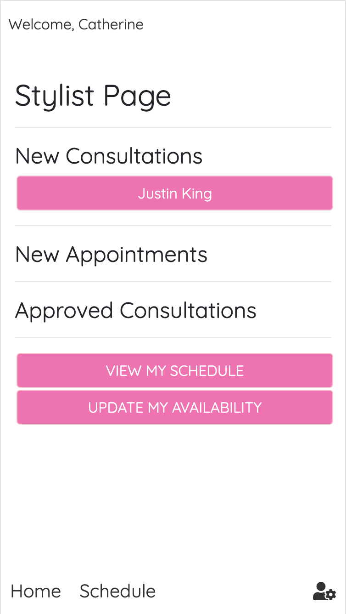
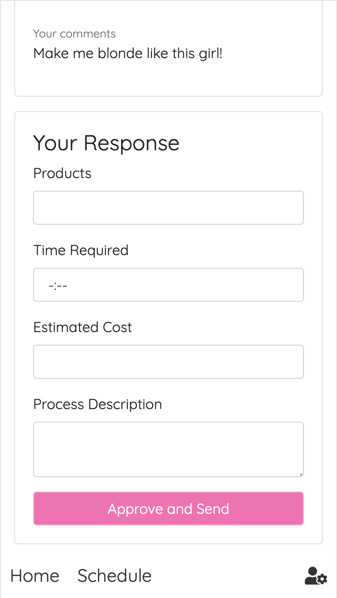
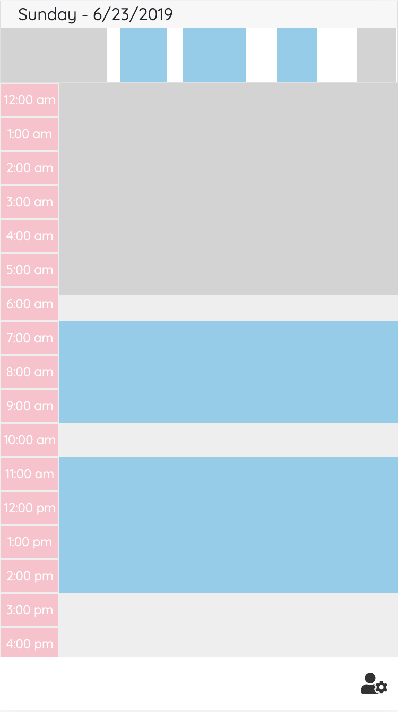
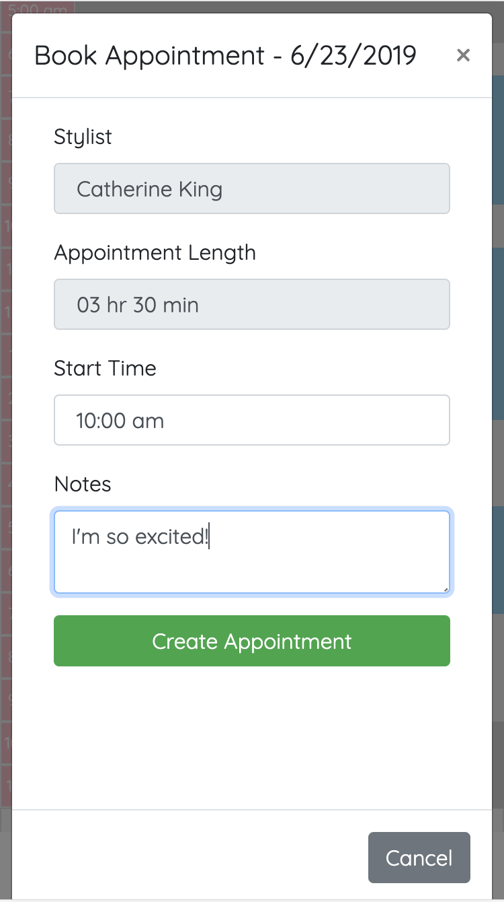

# Summary
Cut / Color is a full-service consultation and scheduling solution designed for salon professionals and is built on the MERN stack.

## Technologies Used
* Node.js
* React
* Express
* Axios
* MongoDB
* Mongoose
* JavaScript / JSX
* JSON Web Tokens (JWTs)
* HTML5
* CSS3
* Bootstrap

## User Flow

When a stylist signs up for an account, a referral code is generated for them to give to their clients. Every time a client signs up for an account using that referral code, they are automatically associated with that stylist. 

When a client logs in, they will have the option to start a consultation with their stylist. 

The consultation process allows a user to upload photos of their current hair and their dream hair using a cloudinary widget along with a description of the intended outcome for the service.

This information is saved and kicked over to the stylist. The client will be able to review their pending consultation and delete it if they change their mind before it has made it through the approval process. When the stylist logs in next, they will see the new consultation in their home screen awaiting review. The stylist then determines what the process would entail to achieve the desired result and responds to the client by entering the products necessary, the time required, a cost estimate, and a description of the process for the client to gain a better understanding of the services they need.

The client can now review the response from their stylist and decide if that is a service that they would like to book. When a client makes a booking from an approved consultation, the stylist and length of the appointment are prefilled to ensure that the stylist can perform the service in it's entirety. This also prevents clients from trying to squeeze a service in where there just isn't enough time. 

## Technical Notes

A single page application (SPA) that uses react-router and axios to interact with a very loosely coupled back-end. The back-end can sign up, log in, or verify a user using JSON web tokens (JWTs). 

## Database Models

### User Schema
| Column | Data Type | Description |
|--------|-----------|-------------|
| firstname | String |  Required Field |
| lastname | String | Required Field |
| email | String | UsernameField for login - required field |
| password | String | Hashed with BCrypt |
| referral | String | Associates client with a stylist |
| stylist | Boolean | Is or isn't a stylist |
| phone | String | - |

### Stylist Schema
| Column | Data Type | Description |
|--------|-----------|-------------|
| user | ObjectId |  References User |
| client | [ObjectId] | References Client |
| salon | ObjectId | References Salon |
| availability | Mongoose Schema | Embeds Availability Schema |

#### Availability Schema
| Column | Data Type | Description |
|--------|-----------|-------------|
| 0 | Array |  Sunday |
| 1 | Array | Monday |
| 2 | Array | Tuesday |
| 3 | Array | Wednesday |
| 4 | Array | Thursday |
| 5 | Array | Friday |
| 6 | Array | Saturday |

### Client Schema
| Column | Data Type | Description |
|--------|-----------|-------------|
| user | ObjectId |  References User |
| stylist | ObjectId | References Stylist |

### Consultation Schema
| Column | Data Type | Description |
|--------|-----------|-------------|
| stylist | ObjectId |  References Stylist |
| client | ObjectId | References Client |
| currentHair | [String] | Array of image urls stored on cloudinary |
| dreamHair | [String] | Array of image urls stored on cloudinary |
| clientComment | String | - |
| stylistComment | String | - |
| approved | Boolean | Tracks status of consultation |
| products | [String] | Array of products required |
| apptLength | Number | Length in milliseconds |
| estimate | Number | Cost in $USD |
| scheduled | Boolean | Has the consultation been approved and scheduled |

### Appointment Schema
| Column | Data Type | Description |
|--------|-----------|-------------|
| date | Number | Stored in unix time |
| start | Number | Stored in unix time |
| end | Number | Stored in unix time |
| apptLength | Number | Length in milliseconds |
| stylist | ObjectId |  References Stylist |
| client | ObjectId | References Client |

### Salon Schema
| Column | Data Type | Description |
|--------|-----------|-------------|
| name | String | Salon name |
| manager | [ObjectId] | References User |
| details | String | - |

## Backend Routes
METHOD | URL | Purpose
--- | --- | ---
POST | /auth/signup | Adds new user to user database
POST | /auth/login | Authenticates login details
POST | /auth/current/user | If token present, refresh user data
POST | /appointment | Creates a new appointment
PUT | /appointment/apptdisplay | Update appointment with stylist response
POST | /appointment/day/stylist | Find stylist's appointments for stylist view
POST | /appointment/day/client | Find stylist's appointments for client view
PUT | /appointment/availability | Update stylist's availability
POST | /appointment/availability | Find stylist's availability by stylist id
POST | /appointment/availability/client | Find stylist's availability for client view
POST | /consultation | Create a consultation
PUT | /consultation/display | Update consultation with stylist response
DELETE | /consultation/display | Delete a consultation when declined
PUT | /consultation/scheduled | Mark a consultation as scheduled
GET | /landing | Find stylist info
POST | /landing | Find unapproved consultations
POST | /landing/consultationApproved | Find approved consultations
POST | /landing/client | Find all information for client landing page
POST | /landing/stylist | Find all information for stylist landing page
POST | /landing/appointment | Find appointment info for stylist landing page
GET | /landing/profile/stylist | Get info for stylist profile
POST | /landing/profile/client | Find info for client profile by user id

